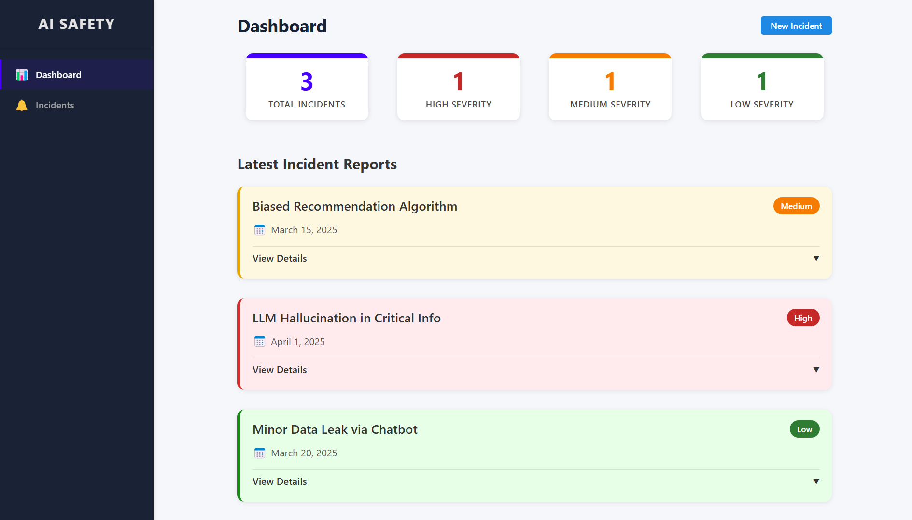

# AI Safety Incident Dashboard

A modern web application built with React, TypeScript, and Vite.

## Deployment

This project is deployed on Netlify. You can view the live demo [here](https://skp-ai-safety-dashboard.netlify.app/).

## Tech Stack

- **Frontend**: React 19 with TypeScript
- **Routing**: React Router
- **Build Tool**: Vite
- **Styling**: CSS (customizable)
- **Package Manager**: npm

## Getting Started

### Installation

1. Clone the repository:

   ```bash
   git clone https://github.com/iamskpandey/skp-ai-safety-dashboard.git
   cd skp-ai-safety-dashboard
   ```

2. Install dependencies:
   ```bash
   npm install
   ```

### Running the Application

To start the development server:

```bash
npm run dev
```

This will start the application in development mode. Open [http://localhost:5173](http://localhost:5173) to view it in the browser.

### Building for Production

To create a production build:

```bash
npm run build
```

The build artifacts will be stored in the `dist/` directory.

To preview the production build locally:

```bash
npm run preview
```

## Project Structure

```
my-project-sparklehood/
├── src/                  # Source files
│   ├── assets/           # Static assets
│   ├── components/       # Reusable UI components
│   ├── features/         # Feature-specific modules
│   ├── layouts/          # Page layout components
│   ├── pages/            # Page components
│   ├── routes/           # Routing configuration
│   ├── types/            # TypeScript type definitions
│   ├── utils/            # Utility functions
│   ├── App.tsx           # Main App component
│   └── main.tsx          # Entry point
├── public/               # Public static files
├── index.html            # HTML template
├── vite.config.ts        # Vite configuration
├── tsconfig.json         # TypeScript configuration
└── package.json          # Project dependencies and scripts
```

## Scripts

- `npm run dev` - Starts the development server
- `npm run build` - Builds the app for production
- `npm run lint` - Runs the linter
- `npm run preview` - Previews the production build locally

## License

[MIT](LICENSE)
